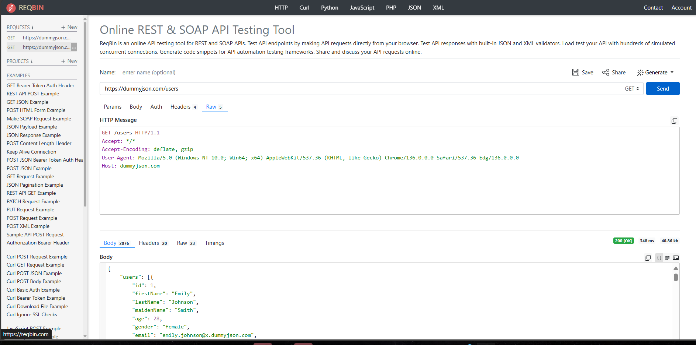
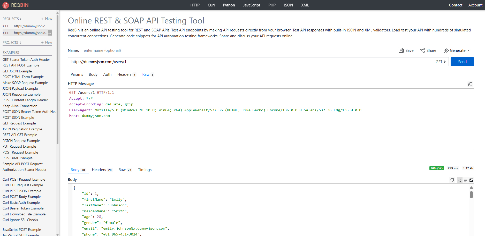

# Desafio Imersão 360 - Webservices

Este projeto é parte do desafio da Imersão 360, focado em WebAPIs REST. Utilizamos a API pública [DummyJSON](https://dummyjson.com/docs/users) para realizar operações básicas como listar usuários, buscar por ID, criar, atualizar, autenticar e consultar informações do usuário logado.

## 🧪 Testes Realizados com ReqBin

### 🔍 Listar todos os usuários
- Método: `GET`
- URL: `https://dummyjson.com/users`


---

### 🔍 Buscar informações de um usuário específico
- Método: `GET`
- URL: `https://dummyjson.com/users/1`


---

### ➕ Criar um usuário
- Método: `POST`
- URL: `https://dummyjson.com/users/add`
- Body:
```json
{
  "firstName": "João",
  "lastName": "Silva",
  "age": 30
}
